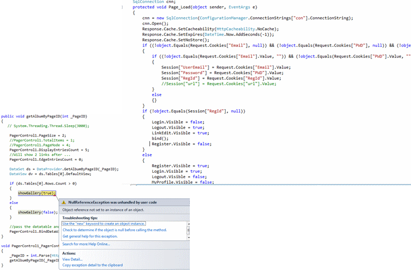

# MVC and Sitecore

```c#
public class MyController : Controller {
	public ActionResult Index() {
	}
}
```
* ASP.Net MVC
* ASP.Net WebApi
* Sitecore and MVC


note:
Welcome to this friday session about MVC as shown with this code snippet. Have you heard about MVC, or even used and developed using MVC?
We will get around first a bit of background for this and then we will look at those specific technologies: ASP.Net Mvc and WebApi as they are very related 
and at last we will take a look at Sitecore and MVC. 

I have some slides with what i think it is important that we talk about, 
if you have questions just ask and we will take them as we proceed.
Afterwards we will look at some code and end with 
you working with this on your own workstations.    


---


## What's all the mess about...

{.no-border}


note:
This is just some messy code I found on the internet, maybe 10 years ago this kind was not uncommon. 
Why is this a problem? With a lot of logic in the UI/controls it tends to be highly coupled and complex, 
probably also duplicated, and it is barely testable 
so there is a high risk of runtime errors, 
we can hardly refactor it and if we try to the system probably becomes inconsistent 
and maybe something else will brake. 

---

## What are we striving for

* Maintainable
* Testable
* Separation of concerns
* Domain driven
* SOLID


note:
Some words of what we are striving for and are getting increasingly focus.
We want code that is maintanable and testable. Systems will live for several years and it is very important that we later on can get into the code and make changes without too many worries.
I have putted some of the words on we strive for a domain driven or at least inspired design for or systems and we go for the SOLID principles. Maybe you have heard of those? We will not dig into it now, you can read about it afterwards but the first one is Single Responsibility - a class or module should only have one reason to change
   
   
---


## Separation of concerns

``` uml
[<frame>MVP|
 [Presenter]->[Model]
 [Presenter]<-[View]
 [View]-->[Model]
]
[<frame>MVC|
 [Controller]->[Model]
 [Controller]<-[View]
 [View]-->[Model]
]
```

---


## How does this differ

```uml
[<frame>MVP|
 [Presenter]->[Model]
 [Presenter]<-[View]
 [<actor>Incoming Request]->[View]
]
[<frame>MVC|
 [Controller]->[Model]
 [Controller]<-[View]
 [<actor>Incoming Request]->[Controller]
]
```
